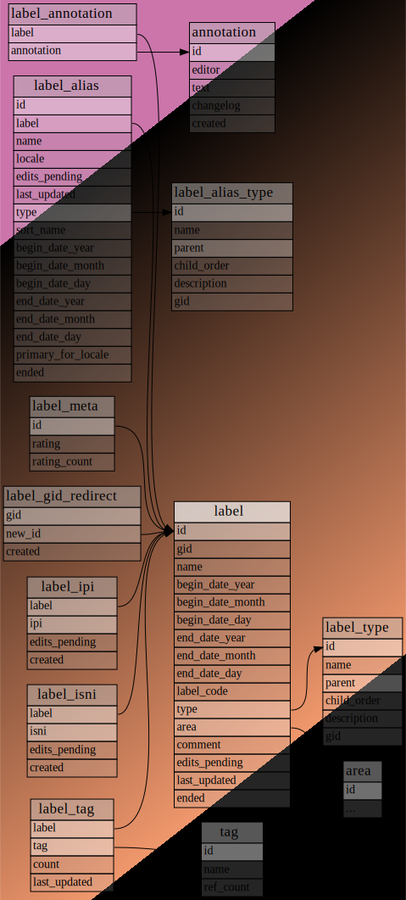
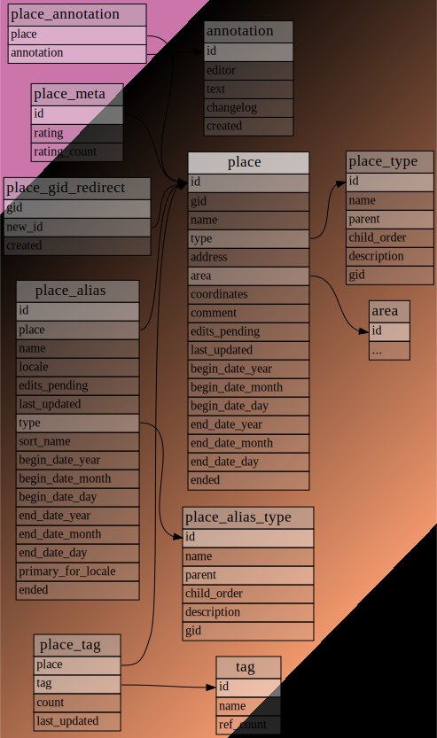
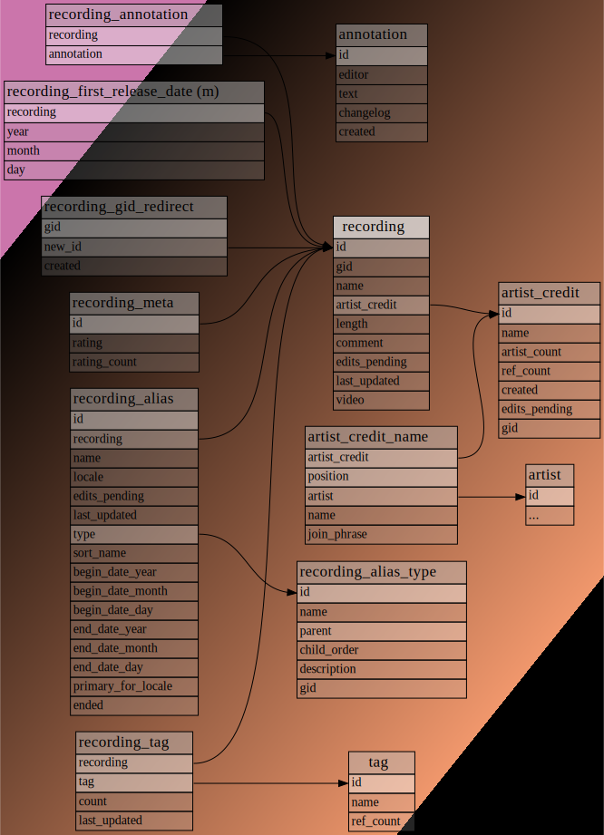
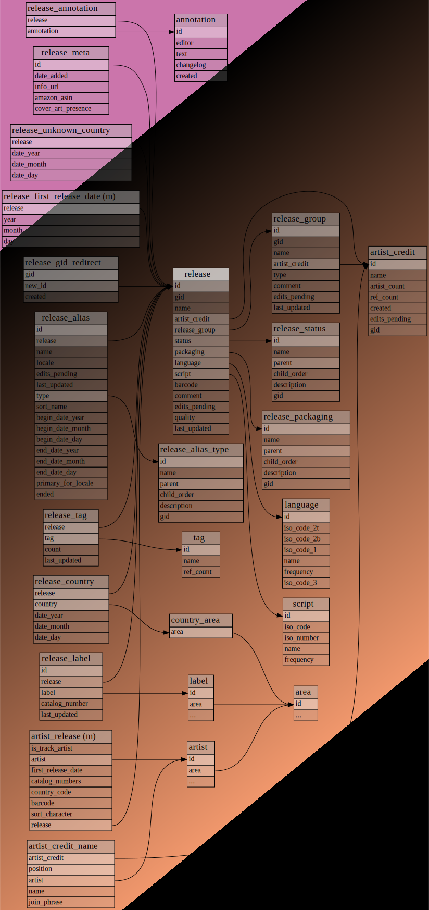
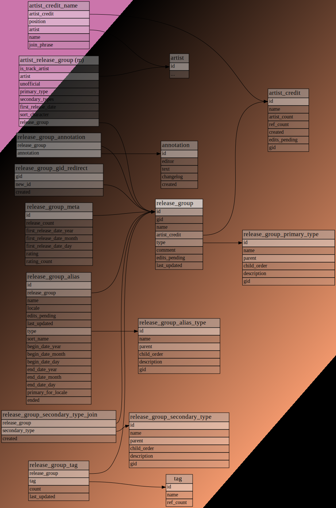
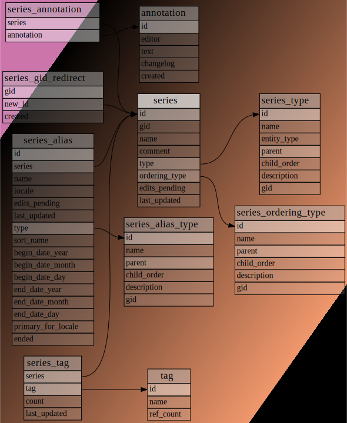
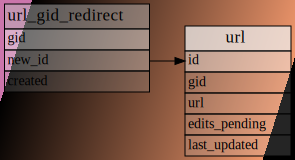
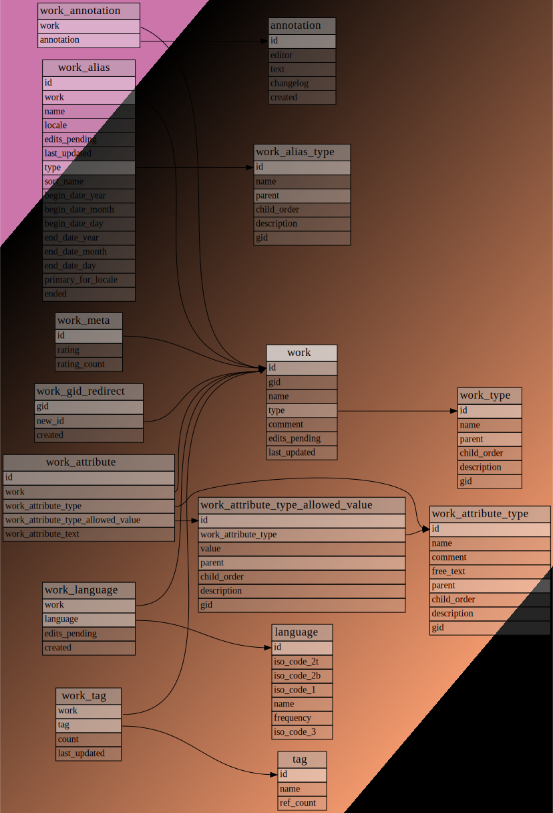

## T3 | Etapa 1 | Seleção e modelagem de dados

### Primeira fonte de dados

[MusicBrainz Database](https://musicbrainz.org/doc/MusicBrainz_Database)

The MusicBrainz Database is built on the PostgreSQL relational database engine and contains all of MusicBrainz' music metadata. This data includes information about artists, release groups, releases, recordings, works, and labels, as well as the many relationships between them. The database also contains a full history of all the changes that the MusicBrainz community has made to the data.

#### Data dumps

https://data.metabrainz.org/pub/musicbrainz/data/fullexport/20241127-001710/

#### Esquema lógico/físico do banco de dados relacional

Overview
The SQL scripts that create the schema can be found in our [source code repository](https://github.com/metabrainz/musicbrainz-server/tree/master/admin/sql).

The database is structured around primary entities which can be edited, searched for, referred to by MBID, and linked to each other through [relationships](https://musicbrainz.org/doc/Relationships) or foreign key constraints in some case. Secondary entities cannot be linked through relationships, instead they are directly linked through foreign key constraints only. Each primary entity type has a main table sometimes accompanied by complementary tables of which a few are unique but most are common.

- The first diagram below shows the main tables for primary entity types and unique tables connecting these tables, that is, beyond relationships. The main tables are highlighted. All tables are shortened to focus on foreign key constraints.
- The second diagram additionally shows the main tables for primary entity types and tables unique to some of these, that is, beyond aliases, annotations, edits, redirects, relationships, ratings, tags.

Primary entities
Each primary entity has a main table with the same name as the entity, containing its basic data.

**Area**

Tables for the “area” core entity type properties	A country, region, city or the like.
Areas that can be used for filling in the Release country field of releases are listed, by ID, in the country_area table.
The table area_containment is materialized (m).

**Artist**

Tables for the “artist” core entity type properties	An artist is generally a musician, a group of musicians, or another music professional (composer, engineer, illustrator, producer, etc.)
The tables artist_release and artist_release_group are materialized (m).

**Event**

Tables for the “event” core entity type properties	An event refers to an organised event which people can attend, and is relevant to MusicBrainz. Generally this means live performances, like concerts and festivals.

**Genre**

Tables for the “genre” core entity type properties	A genre is a descriptor for the style and conventions followed by a piece of music.

**Instrument**

Tables for the “instrument” core entity type properties	Instruments are devices created or adapted to make musical sounds. We also list common instrument groupings (such as string quartet) as instruments.

**Label**

Tables for the “label” core entity type properties	Labels represent mostly (but not only) imprints.

**Place**

Tables for the “place” core entity type properties	A venue, studio or other place where music is performed, recorded, engineered, etc.

**Recording**

Tables for the “recording” core entity type properties	Represents a unique mix or edit. Has title, artist credit, duration, list of ISRCs. Examples (all are different Recordings):
Album version of the track "Into the Blue" by "Moby"
Remix "Into the Blue (Buzz Boys Main Room Mayhem mix)" by "Moby"
Remix "Into the Blue (Underground mix)" by "Moby"
The table recording_first_release_date is materialized (m).

**Release**

Tables for the “release” core entity type properties	Real-world release object you can buy in your music store. It has release date and country, list of catalog number and label pairs, packaging type and release status. Examples:
1984 US release of "The Wall" by "Pink Floyd", release on label "Columbia Records" with catalog number "C2K 36183" and UPC "074643618328", it's an official release and comes with two CDs in jewel case.
The tables artist_release and release_first_release_date are materialized (m).

**Release group**

Tables for the “release group” core entity type properties	Represents an abstract "album" (or "single", or "EP") entity. Technically it's a group of releases, with a specified type. Examples:
Single "Under Pressure" by "Queen & David Bowie"
Album "The Wall" by "Pink Floyd"
The table artist_release_group is materialized (m).

**Series**

Tables for the “series” core entity type properties	A series is a sequence of separate release groups, releases, recordings, works or events with a common theme. The theme is usually prominent in the branding of the entities in the series and the individual entities will often have been given a number indicating the position in the series.

**URL**

Tables for the “URL” core entity type properties	This entity represents a URL pointing to a resource external to MusicBrainz, i.e. an official homepage, a site where music can be acquired, an entry in another database, etc.

**Work**

Tables for the “work” core entity type properties	One layer above recordings ("song", "composition", etc.). While a recording represents audio data, a work represents the composition behind the recording. Relationships are used to link recordings and works.
Song "Into the Blue" by "Moby" -- all the recordings listed above will be linked to this object

#### Elaboração do script SQL-DDL para criação das tabelas

#### Elaboração do script SQL-DML para inserção de dados nas tabelas
