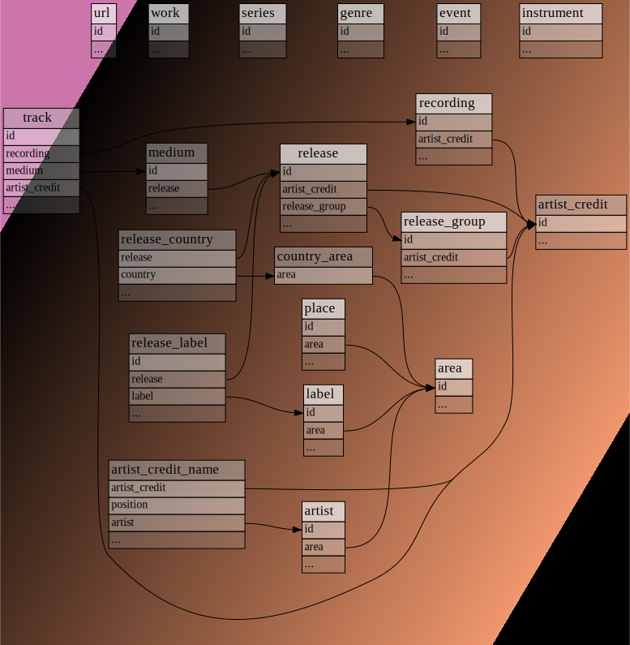
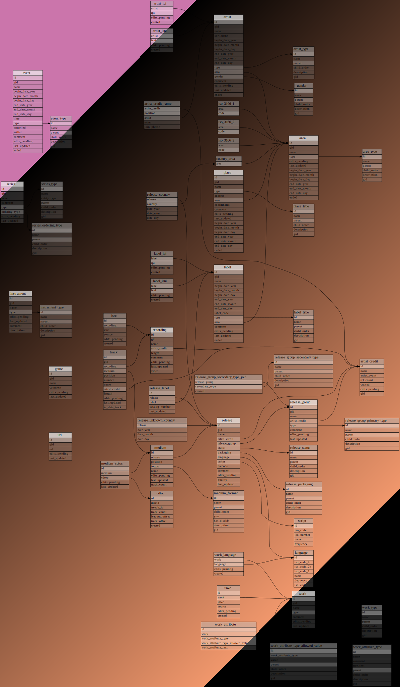
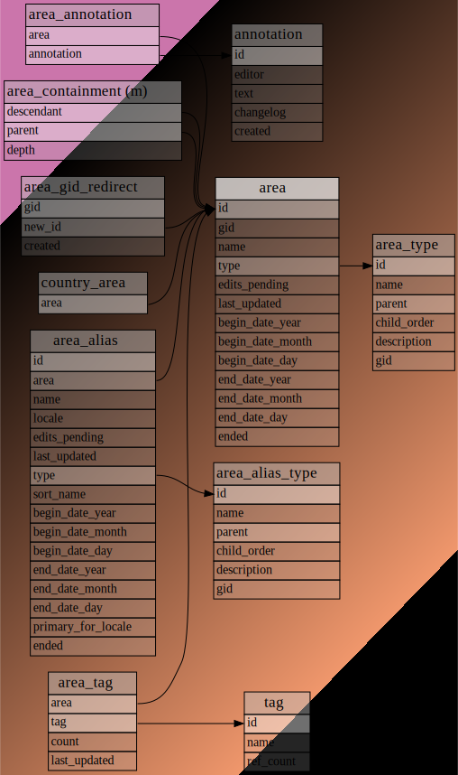
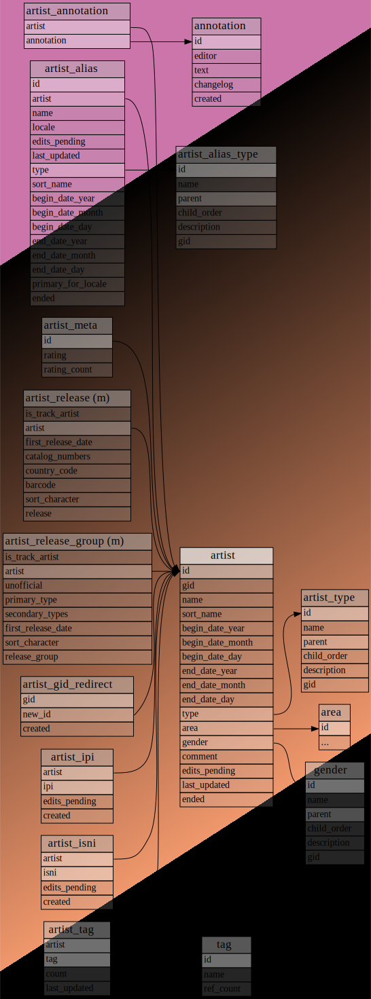
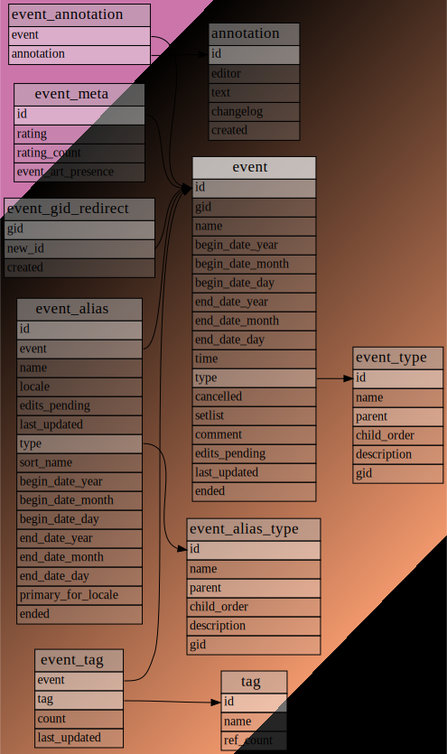
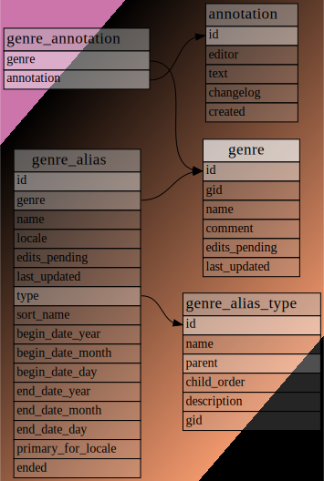
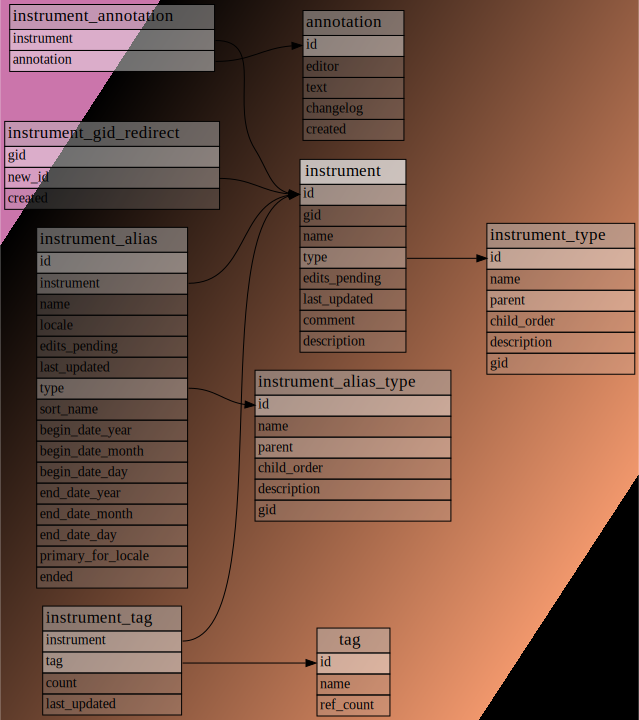

## T3 | Etapa 1 | Seleção e modelagem de dados

### Primeira fonte de dados

[MusicBrainz Database](https://musicbrainz.org/doc/MusicBrainz_Database)

The MusicBrainz Database is built on the PostgreSQL relational database engine and contains all of MusicBrainz' music metadata. This data includes information about artists, release groups, releases, recordings, works, and labels, as well as the many relationships between them. The database also contains a full history of all the changes that the MusicBrainz community has made to the data.

#### Data dumps

https://data.metabrainz.org/pub/musicbrainz/data/fullexport/20241127-001710/

#### Esquema lógico/físico do banco de dados relacional

[MusicBrainz Official Schema](https://musicbrainz.org/doc/MusicBrainz_Database/Schema)

Overview
The SQL scripts that create the schema can be found in our [source code repository](https://github.com/metabrainz/musicbrainz-server/tree/master/admin/sql).

The database is structured around primary entities which can be edited, searched for, referred to by MBID, and linked to each other through [relationships](https://musicbrainz.org/doc/Relationships) or foreign key constraints in some case. Secondary entities cannot be linked through relationships, instead they are directly linked through foreign key constraints only. Each primary entity type has a main table sometimes accompanied by complementary tables of which a few are unique but most are common.

- The first diagram below shows the main tables for primary entity types and unique tables connecting these tables, that is, beyond relationships. The main tables are highlighted. All tables are shortened to focus on foreign key constraints.
- The second diagram additionally shows the main tables for primary entity types and tables unique to some of these, that is, beyond aliases, annotations, edits, redirects, relationships, ratings, tags.





**Primary entities**

Each primary entity has a main table with the same name as the entity, containing its basic data.

**Area**



A country, region, city or the like.
Areas that can be used for filling in the Release country field of releases are listed, by ID, in the country_area table.

**Artist**



An artist is generally a musician, a group of musicians, or another music professional (composer, engineer, illustrator, producer, etc.)

**Event**



An event refers to an organised event which people can attend, and is relevant to MusicBrainz. Generally this means live performances, like concerts and festivals.

**Genre**



A genre is a descriptor for the style and conventions followed by a piece of music.

**Instrument**



Instruments are devices created or adapted to make musical sounds. We also list common instrument groupings (such as string quartet) as instruments.

**Types**

*_type tables are simply mappings between strings and ID numbers, representing various sets of types. Areas, artists, events, instruments, labels, places, series and works are the only primary entities with each have a *_type and an *_alias_type table. Release groups have release_group_primary_type and release_group_secondary_type tables. Genres, recordings and releases only have *_alias_type tables, and URLs do not have *_type tables at all.

---

#### Elaboração do script SQL-DDL para criação das tabelas

Todos os scripts SQL-DDL utilizados estão disponíveis na pasta [SQL](./sql).

Eles foram gerados a partir do [Repositório Oficial - MusicBrainz Server](https://github.com/metabrainz/musicbrainz-server/tree/master/admin/sql).

Ainda, todos os scripts já estão ordenados de acordo com as dependências entre as tabelas.

Para criar as tabelas do banco de dados, basta executar o script [CreateTables.sql](./sql/CreateTables.sql) no PostgreSQL.

Para restrições do tipo `PRIMARY KEY`, execute o script [CreatePrimaryKeys.sql](./sql/CreatePrimaryKeys.sql).

Para restrições do tipo `FOREIGN KEY`, execute o script [CreateFKConstraints.sql](./sql/CreateFKConstraints.sql).

Para outras restrições importantes e indexações, execute o script [CreateIndexes.sql](./sql/CreateIndexes.sql).

#### Elaboração do script SQL-DML para inserção de dados nas tabelas

Os dados utilizados para popular o banco de dados foram obtidos a partir dos [Data Dumps](https://data.metabrainz.org/pub/musicbrainz/data/fullexport) oficiais do MusicBrainz.

Para inserir os dados nas tabelas do banco de dados, é necessário primeiramente escolher um dos arquivos disponíveis no link acima, baixar o arquivo `mbdump.tar.bz2` e descompactá-lo. Este processo pode demorar um pouco, pois o arquivo é grande (aproximadamente 5.4 GB no momento). Após descompactar o arquivo localmente, deve-se executar o script [get_dumps_minified.sh](./get_dumps_minified.sh) para obter os arquivos necessários para popular o banco de dados.

Este script irá gerar arquivos na pasta [dumps](./dumps) com os dados necessários para popular o banco de dados. Para executar o script, basta rodar o comando abaixo, onde `<count_rows>` é o número de linhas que deseja extrair de cada tabela - por padrão este valor é 1000, mas o ideal é que seja um valor maior, como 120000 por exemplo, embora isso possa demorar um pouco mais.

```bash
./get_dumps_minified.sh <count_rows>
```

```bash
./get_dumps_minified.sh 119500
```

O script apenas extrai as linhas dos arquivos originais e os salva em arquivos menores, para facilitar a inserção dos dados no banco de dados - originalmente as tabelas possuem mais de um milhão de linhas cada.

Após executado, deve-se executar um script python que, este sim, irá inserir os dados nas tabelas do banco de dados e prover os arquivos Insert_*.sql para inspeção e execução manual (opcional). Para executar o script python, é necessário criar um arquivo `.env` na raiz do projeto baseado no arquivo `.env.example` e preencher as variáveis de ambiente com as informações do seu banco de dados.

Após preenchido o arquivo `.env`, basta executar os comandos abaixo no seu ambiente Python de preferência:

```bash
pip install -r requirements.txt
python import_table.py
```

Pronto! Agora você já tem os arquivos `Insert_*.sql` disponíveis na pasta [sql](./sql) e os dados já devem estar disponíveis no seu banco de dados.

Para validar a inserção dos dados, criamos um script [SelectAll.sql](./sql/SelectAll.sql) que executa um `SELECT *` em todas as tabelas do banco de dados.

Segue uma tabela com a quantidade esperada de linhas em cada tabela do banco de dados:

| Tabela | Quantidade de Linhas |
| --- | --- |
| area_type | 9 |
| artist_type | 6 |
| event_type | 8 |
| instrument_type | 7 |
| gender | 5 |
| genre | 1995 |
| area | 119489 |
| artist | >=119500 |
| event | 91440 |
| instrument | 1048 |
